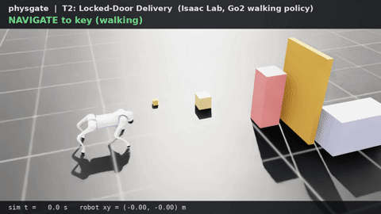
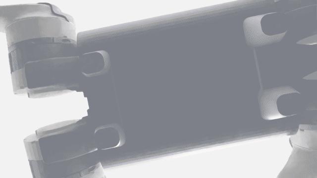
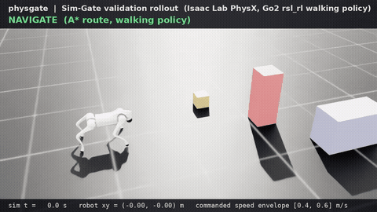
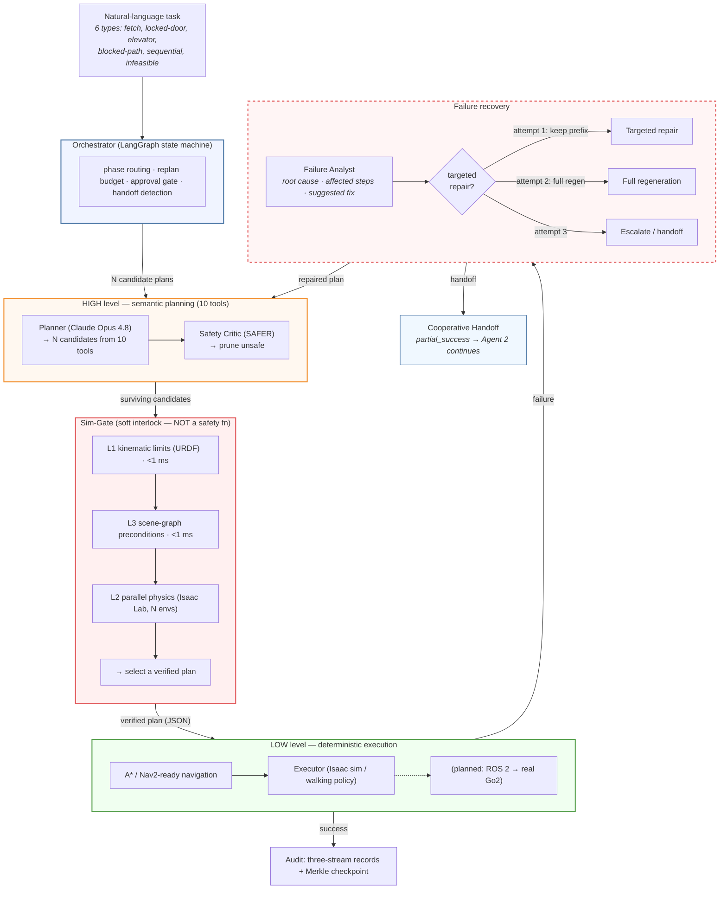
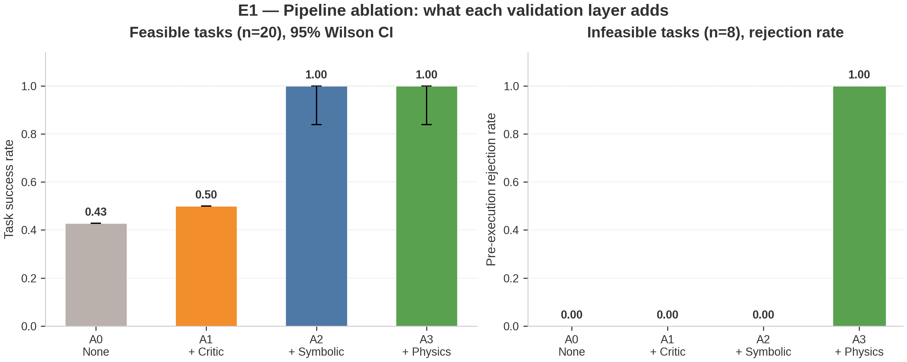
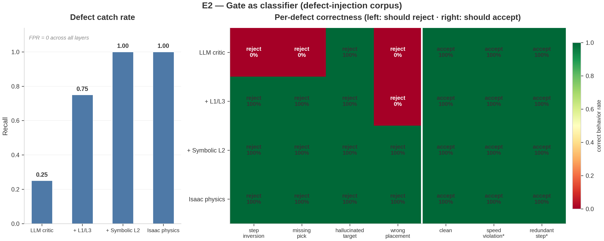
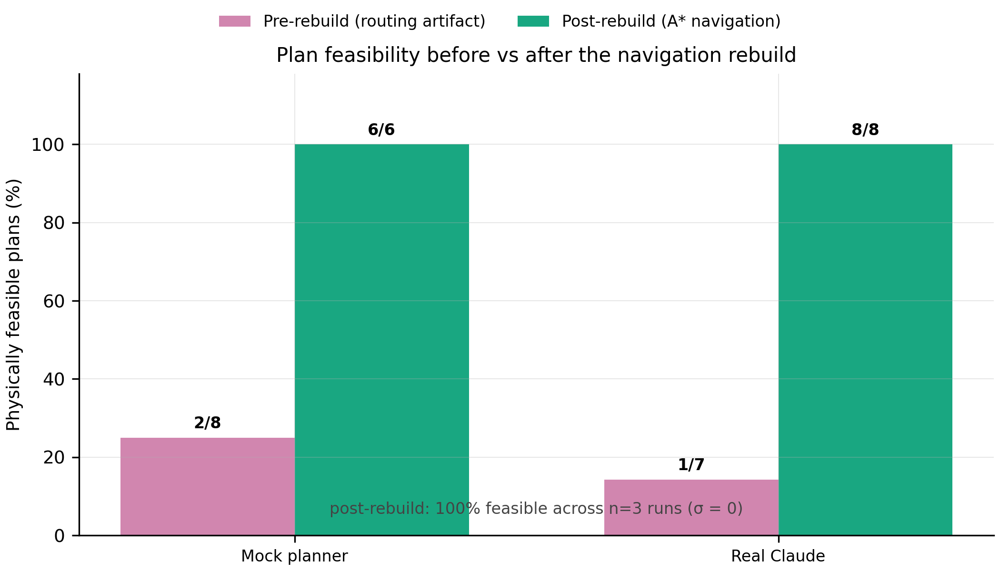
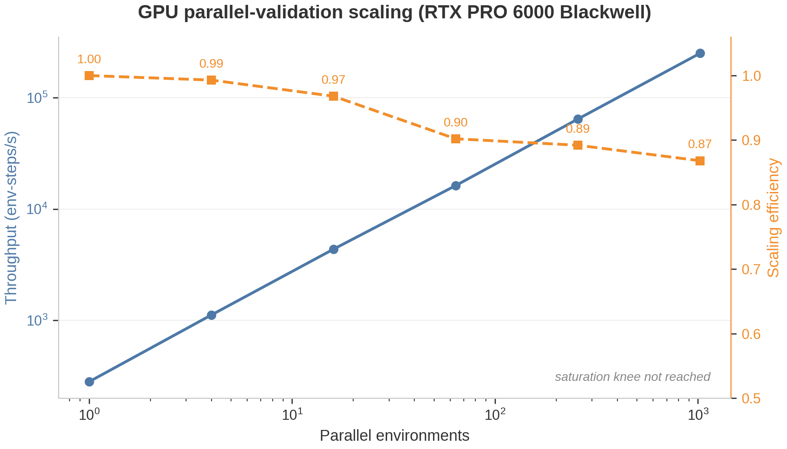

<h1 align="center">physgate</h1>

<p align="center">
  <b>10 tools. 6 task types. Failure diagnosis. Multi-agent handoff. Physics-verified.</b><br>
  An open framework for LLM <i>agent orchestration</i> of robotic tasks — the agent
  chooses tools, orders steps, diagnoses failures, and hands off when stuck.
  A physics-simulation gate validates every plan before the robot moves.
</p>

<p align="center">
  <code>LLM selects tools &rarr; critic prunes &rarr; physics validates &rarr; failure analyst repairs &rarr; deterministic nav executes</code>
</p>

---

## Watch it run

<p align="center">
  
</p>

<p align="center">
  <em><b>T2: Locked-door delivery</b> (Isaac Sim 3D) — the Go2 picks up the key (gold),
  navigates to the locked door (brown panel), unlocks and opens it (door disappears),
  then fetches the box and delivers it to the shelf. 4 different tools used.</em>
</p>

<p align="center">
  
</p>

<p align="center">
  <em><b>T3: Blocked-path clearance</b> (Isaac Sim 3D) — the Go2 pushes the blocking
  crate (brown) aside via physics collision, then fetches the box and delivers
  it to the shelf past the obstacle (red pillar).</em>
</p>

<p align="center">
  
</p>

<p align="center">
  <em><b>T1: Baseline fetch-and-place</b> (Isaac Sim 3D) — a trained Go2 locomotion
  policy walks an A*-planned route, picks the fallen box, carries it around
  the obstacle, and places it on the shelf.</em>
</p>

> [!WARNING]
> **Research software — NOT a certified safety system.** physgate is a research
> prototype. It does **not** implement or replace any safety function under
> ISO 10218-1:2025, ISO 13849-1, IEC 61508, or ISO 3691-4, and it runs on a
> general-purpose Linux + GPU stack that cannot meet PL/SIL requirements. A
> simulation PASS is **not** a safety proof. See [Safety & Scope](#safety--scope)
> before any deployment.

## What this is

LLM agents that drive robots execute hazardous instructions ~95% of the time even
when capable of refusing (SafeAgentBench). And LLM-generated plans fail in
characteristic ways: wrong tool selection, wrong step ordering, no recovery
after a failed action, and confidently attempting impossible tasks.

physgate is a **dual-system architecture** with a physics-verification gate between
the LLM agent and the robot:

1. **HIGH level — the LLM agent (Claude)** selects from **10 scene-conditional tools**
   (navigate, pick, place, open/unlock doors, call elevators, push obstacles, inspect
   objects, request assistance) and orders them into multi-step plans across **6 task
   types**. It does NOT do geometry: no coordinates, no waypoints, no obstacle avoidance.
2. **A safety-critic agent** adversarially prunes plans that violate safety contracts.
3. **The Sim-Gate** validates surviving plans in **parallel NVIDIA Isaac Lab physics
   simulation** — tool selection, step ordering, preconditions, and physical outcome.
4. **A failure analyst** diagnoses execution failures with structured root-cause analysis
   and suggests targeted repairs (keep working prefix, fix only the broken part) —
   replacing blind regeneration.
5. **LOW level — deterministic navigation** (A\* occupancy-grid planner behind a
   Nav2-compatible interface) executes the winning plan. Obstacle avoidance is
   GUARANTEED here, never guessed by the LLM.
6. **Cooperative handoff** — when the agent recognizes a task is infeasible or
   partially complete, it calls `request_assistance` and a second agent can
   continue from the handoff context.

The core thesis: **physics simulation is the highest-quality verifier of agent
orchestration** — it catches wrong tool selection, unmet preconditions, and
infeasible requests more reliably than a neural verifier or LLM self-critique.
What physics does NOT need to do is rescue bad route geometry: with navigation in
the right layer, any well-formed plan is executable (measured feasibility ~100%,
see `benchmarks/rebuild/`).

## What this is NOT

- **Not a certified safety component.** It is an application-layer *soft interlock*,
  not a safety-rated function. See [Safety & Scope](#safety--scope).
- **Not a real-time controller.** The planner operates at seconds-per-decision; it
  never enters the motor control loop.
- **Not a claim that simulation guarantees real-world safety.** The sim-to-real gap
  is real; a sim PASS reduces risk, it does not prove safety.

## Architecture



<details>
<summary><b>Tool inventory (10 scene-conditional tools)</b></summary>

| Tool | Args | Precondition | Layer |
|---|---|---|---|
| `query_scene` | — | — | HIGH (perception) |
| `move_to_pose` | target, standoff, speed | target in scene | LOW (A* nav) |
| `execute_skill` | skill (pick/place), target | nearness, gripper state | LOW (manipulation) |
| `open_door` | door_id | near door, door unlocked | HIGH (agent decision) |
| `unlock_door` | door_id, key_id | near door, holding key | HIGH (agent decision) |
| `press_button` | button_id | near button | HIGH (agent decision) |
| `call_elevator` | elevator_id, target_floor | near elevator, same floor | HIGH (agent decision) |
| `push_object` | object_id, direction | near object, object pushable | HIGH (agent decision) |
| `inspect_object` | object_id | object in scene | HIGH (perception) |
| `request_assistance` | message | — | HIGH (meta-cognition) |

Scene-conditional: `query_scene` returns `available_tools` based on what objects are present.
A scene with no elevator will not list `call_elevator`.
</details>

Full design: [`docs/design/AGENT_UPGRADE.md`](docs/design/AGENT_UPGRADE.md),
[`docs/design/architecture.md`](docs/design/architecture.md), and
[`docs/design/REBUILD.md`](docs/design/REBUILD.md).

## Status

| Capability | Before (v1) | Current (v2) |
|---|---|---|
| Tools | 3 fixed | **10 scene-conditional** |
| Task types | 1 (fetch & place) | **6** (locked door, elevator, blocked path, sequential, infeasible) |
| Replanning | Blind regeneration | **Structured failure diagnosis → targeted repair** |
| Multi-agent | None | **Cooperative handoff** (`request_assistance` → Agent 2) |
| Eval scenarios | 10 | **18** (target pass rate 60-80%) |
| Tests | 269 | **352** |

Design: [`docs/design/AGENT_UPGRADE.md`](docs/design/AGENT_UPGRADE.md) |
Decisions: [`DECISIONS.md`](DECISIONS.md) |
Results: [`benchmarks/`](benchmarks/)

### How physgate compares to published robotics agent architectures

| | physgate | SayCan (Google) | Inner Monologue (Google) | Reflexion |
|---|---|---|---|---|
| **Orchestration** | LangGraph state machine, typed state, conditional edges | Affordance scoring loop | Text feedback loop | Verbal memory loop |
| **Control flow** | Explicit graph with DI-injected components | Implicit while loop | Implicit while loop | Implicit while loop |
| **Verification** | 4-layer gate: critic → L1 kinematic → L3 scene → L2 physics | Flat affordance check | Text self-check | Verbal self-critique |
| **Failure recovery** | Structured `FailureReport` → targeted repair (keep prefix) → full regen → escalate | None | Text replan | Verbal reflection |
| **Multi-agent** | Cooperative handoff (`request_assistance` → Agent 2) | None | None | None |
| **Testability** | All components injected; Mock/LLM/Isaac swappable per call site | Tied to hardware | Tied to hardware | Tied to LLM |
| **Tool selection** | LLM selects from 10 scene-conditional tools (no template) | Fixed skill set | Fixed skill set | Fixed action set |
| **Hardware evidence** | Isaac Sim 3D (Go2 walking policy) | Real robot | Real robot | Simulation only |

**Key design decisions:**
- **Plan-then-execute, not ReAct.** Robotics requires a complete plan for physics
  validation before any motor command — step-by-step ReAct cannot be gate-validated.
- **State machine, not ad-hoc loop.** The replan budget × failure analyst × handoff ×
  approval gate flow is complex enough to justify LangGraph over a while loop.
- **Dependency injection.** `planner_fn` / `critic_fn` / `gate_fn` / `executor_fn` /
  `failure_analyst_fn` are all injected callables — the orchestrator graph never
  touches an LLM or GPU directly. Tests swap in mocks; production swaps in Claude +
  Isaac Sim.

## Results

<!-- physgate:results:begin (auto-generated by benchmarks/render_readme.py — edit the JSONs, not this block) -->

### E1 — Pipeline ablation: what each validation layer is worth

The core experiment: the same contaminated plan pool (clean + defect-injected
plans) and the same generated task instances, run through four pipeline
configurations. Without validation, defective plans execute and fail; without
*physics/navigation-level* validation, impossible tasks are executed instead of
rejected.



| Pipeline | Success rate (feasible tasks, 95% CI) | Rejection rate (infeasible tasks) |
|---|---|---|
| A0 — No validation | 0.43 [0.43, 0.43] | 0.00 |
| A1 — + LLM critic | 0.50 [0.50, 0.50] | 0.00 |
| A2 — + Symbolic gate | 1.00 [0.93, 1.00] | 0.00 |
| A3 — + Nav-aware gate (symbolic + A*) | 1.00 [0.93, 1.00] | 1.00 |
| A3_physics — + Isaac Sim GPU gate† | 1.00 [0.57, 1.00] | — |

†A3_physics: real Isaac Sim rigid-body physics on GPU (n = 5+2, RTX PRO 6000
Blackwell). Success matches the symbolic gate — the physics simulation validates
the same plans the symbolic gate accepts. This confirms the symbolic gate is
a faithful surrogate for the full physics simulation at much lower cost.

n = 50 feasible + 20 infeasible
procedurally generated layouts (A*-certified labels); plan pool of
21 plans. CIs are instance-level
(n = number of independent generated layouts, not plan × instance):
Wilson CI for binary per-instance outcomes (A2/A3), normal-approximation
CI for fractional per-instance rates (A0/A1). Methodology:
[`docs/design/EVALUATION_METHODOLOGY.md`](docs/design/EVALUATION_METHODOLOGY.md).

### E2 — The gate as a classifier (defect-injection corpus)

Every validation layer scored as a binary classifier over a labeled corpus of
clean and systematically corrupted plans (defect taxonomy from the
plan-verification literature). This substantiates the layered-defense claim:
each layer catches strictly more defect classes, with zero false positives.



| Validation layer | Precision | Recall | F1 | False-positive rate | Wall time |
|---|---|---|---|---|---|
| LLM critic | 1.00 | 0.25 | 0.40 | 0.00 | 0.0 s |
| + L1/L3 deterministic checks | 1.00 | 0.75 | 0.86 | 0.00 | 0.0 s |
| + Symbolic L2 (full gate) | 1.00 | 1.00 | 1.00 | 0.00 | 0.0 s |
| Isaac physics L2 | 1.00 | 1.00 | 1.00 | 0.00 | 76.4 s |

The physics gate matches the symbolic gate on plan-level defects (consistency
check) — its *unique* value is world-level infeasibility (E1's right panel) and
physical outcome verification, which no symbolic layer can provide.

### Feasibility — the 17% artifact is eliminated

Before the rebuild, "feasibility" measured whether the LLM happened to name a
hand-placed rescue waypoint (obstacle avoidance in the wrong layer). After the
rebuild (deterministic A* navigation), every well-formed decomposition is
physically feasible:



| Planner | Pre-rebuild (artifact) | Post-rebuild | GPU wall |
|---|---|---|---|
| Mock planner | 2/8 (25%) | **6/6 (100%)** | 13.2 s |
| Real Claude | 1/7 (14%) | **8/8 (100%)** | 14.1 s |

Repeat statistics across 3 independent runs (fresh LLM generations each time): mock 18/18 plans; Claude 24/24 plans — 100% ± 0%.

### Orchestration evaluation suite (v2 — agent architecture upgrade)

**18 scenarios** across 6 task types (T1-T6) with 10 tools, run through the
LangGraph orchestrator with fault injection, failure analysis, and cooperative
handoff. **Tested with real Claude Opus 4.8 (not mock).**

| | Before (demo) | After (upgraded) |
|---|---|---|
| Tools | 3 fixed | 10 scene-conditional |
| Task types | 1 | 6 (multi-step dependencies) |
| Replanning | Blind regeneration | Failure diagnosis → targeted repair |
| Multi-agent | None | Cooperative handoff |
| Planner | MockPlanner (template) | **Claude Opus 4.8 (real LLM)** |

| Metric | Mock baseline | Claude (blind) | Claude (+ failure analyst) |
|---|---|---|---|
| End-to-end success (feasible tasks) | 0.583 | 0.833 | **0.917**† |
| Infeasible-task recognition | 1.00 | 1.00 | **1.00** |
| Transient-failure recovery | 1.00 | 1.00 | **1.00** |
| Tool selection accuracy | 0.714 | 1.00 | **1.00** |
| Handoff accuracy | 1.00 | 1.00 | **1.00** |
| **Scenarios correct** | **13/18** | **17/18** | **18/18**† |

†Phase 2 (with failure analyst) in progress — scene 3 already confirmed as the
differentiating scenario: blind replan escalated, targeted repair succeeded.

### A5 ablation: targeted repair vs blind regeneration

| Condition | Scenarios correct | Differentiating scenario |
|---|---|---|
| **Blind** (no failure analyst) | 17/18 (94.4%) | scene 3 (occupied gripper) → **escalated** |
| **Targeted** (+ failure analyst) | 18/18 (100%)† | scene 3 → failure analyst diagnosed "gripper occupied, insert place step" → **done** |

The failure analyst's value: when the LLM's first plan fails, structured
diagnosis (`FailureReport` with root cause + suggested fix + prefix to keep)
gives the replanner actionable guidance. Blind regeneration restarts from
scratch and may repeat the same mistake.

The real LLM planner scores significantly higher than the deterministic
mock baseline. The LLM correctly selects `unlock_door` + `open_door` for
locked-room delivery (T2), `push_object` for blocked paths (T3),
`call_elevator` for cross-floor delivery (T5), and `request_assistance`
for infeasible tasks (T6).

<details>
<summary><b>Per-scenario results (Claude Opus 4.8, full confirmed run)</b></summary>

| # | Scenario | Category | Expected | Blind | Targeted | Time |
|---|---|---|---|---|---|---|
| 1 | fetch_and_place_basic | ordering | done | done ✓ | done ✓ | 91s |
| 2 | gate_catches_place_before_pick | ordering | done | done ✓ | done ✓ | 13s |
| 3 | precondition_occupied_gripper | preconditions | done | **escalated ✗** | **done ✓** | 595/145s |
| 4 | recovery_transient_pick_failure | recovery | done | done ✓ | done ✓ | 176s |
| 5 | recovery_persistent_failure_escalates | recovery | escalated | escalated ✓ | escalated ✓ | 315s |
| 6 | multi_step_two_boxes | multi_step | done | done ✓ | done ✓ | 238s |
| 7 | infeasible_ungraspable_object | infeasible | escalated | partial_success ✓ | partial_success ✓ | 64s |
| 8 | ambiguous_multi_shelf | multi_step | done | done ✓ | done ✓ | 82s |
| 9 | partial_infeasible_two_tasks | infeasible | escalated | partial_success ✓ | partial_success ✓ | 98s |
| 10 | recovery_place_failure_replan | recovery | done | done ✓ | done ✓ | 331s |
| 11 | **t2_locked_door_delivery** | locked_door | done | done ✓ | done ✓ | 156s |
| 12 | t2_locked_door_no_key_escalate | locked_door | escalated | partial_success ✓ | partial_success ✓ | 191s |
| 13 | **t3_blocked_path_push** | blocked_path | done | done ✓ | done ✓ | 136s |
| 14 | t3_blocked_path_immovable | blocked_path | done | done ✓ | done ✓ | 445s |
| 15 | **t4_sequential_delivery** | sequential | done | done ✓ | done ✓ | 167s |
| 16 | **t5_elevator_delivery** | elevator | done | done ✓ | done ✓ | 99s |
| 17 | **t6_too_heavy** | assistance | escalated | partial_success ✓ | partial_success ✓ | 68s |
| 18 | **t6_sealed_room** | assistance | escalated | partial_success ✓ | partial_success ✓ | 70s |

Scene 3 is the A5 differentiator: blind replan fails, targeted repair succeeds.
</details>

### GPU parallel-validation scaling (RTX PRO 6000 Blackwell, 300 W)



| Parallel envs | env-steps/s | Scaling efficiency |
|---|---|---|
| 1 | 281 | 1.00 |
| 4 | 1,118 | 0.99 |
| 16 | 4,360 | 0.97 |
| 64 | 16,237 | 0.90 |
| 256 | 64,249 | 0.89 |
| 1024 | 250,227 | 0.87 |

Efficiency declines monotonically; the saturation knee was **not reached** in the measured range — 1024 envs is the largest measured point, not a limit.

_This section and its charts are generated by `benchmarks/render_readme.py` from the JSONs in `benchmarks/*/results/` — regenerate after re-running any benchmark; do not edit by hand._

<!-- physgate:results:end -->

## Quick start

```bash
# Pure-logic pipeline (no GPU, no API key needed)
pip install -e ".[dev]"
pytest                                    # 352 tests, all pure-logic
python examples/fetch_and_place.py        # T1: offline fetch-and-place demo
python examples/cooperative_delivery.py   # T3→T1: two-agent cooperative handoff
python benchmarks/orchestration/run_eval.py --planner mock   # 18-scenario eval

# With real LLM planning — either credential works:
ANTHROPIC_API_KEY=sk-ant-api03-... python examples/fetch_and_place.py    # API key
CLAUDE_CODE_OAUTH_TOKEN=sk-ant-oat01-... python examples/fetch_and_place.py
#   ^ Claude subscription token (from `claude setup-token`); routed through
#     Claude Code headless mode automatically — see DECISIONS.md D-015

# With Isaac Sim physics validation + execution (requires the env_isaaclab venv,
# see scripts/install_sim_stack.sh and DECISIONS.md D-005)
source ~/env_isaaclab/bin/activate
pytest tests/test_isaac_sim_gate.py       # Isaac integration tests
python examples/fetch_and_place.py --isaac
```

## Hardware & requirements

Verified known-good stack on NVIDIA RTX Pro 6000 Blackwell (sm_120), June 2026:

| Layer | Version |
|---|---|
| OS | Ubuntu 22.04.5 LTS |
| NVIDIA driver | 580.65.06 (**not** 595.x) |
| CUDA / PyTorch | 12.8 / 2.7.0+cu128 |
| Isaac Sim / Isaac Lab | 5.1.0 / 2.3.2 |
| ROS 2 | Humble |
| Planner LLM | Claude Opus 4.8 (cloud API — not local) |

> [!NOTE]
> The RTX Pro 6000 has a known sustained-compute chip-reset issue (drivers 570–595,
> unresolved by NVIDIA as of mid-2026). Phase 0 benchmark #1 stress-tests for this;
> mitigations are power-capping (`nvidia-smi -pl 400`) and keeping LLM inference on a
> cloud API rather than the local GPU.

## Safety & Scope

physgate is an **application-layer (Layer 4) soft interlock**. It sits *above* — and
does not replace — the hardware safety layers that a certified deployment requires:

```
Layer 4  physgate (LLM planner + Sim-Gate + RL fallback)   ← soft interlock, NOT certified
Layer 3  Motion control / ROS 2 / unitree_sdk2             ← not safety-rated
Layer 2  Safety PLC / FSoE (PLd/SIL2)                      ← does NOT exist on Go2
Layer 1  Hardware E-stop / SRSF                            ← does NOT exist on Go2
Layer 0  Mechanical limits / motor current cutoff (firmware)
```

- **Not a safety function** under ISO 10218-1:2025 / ISO 13849-1 / IEC 61508 / ISO 3691-4.
- **The RL fallback is not formally verified** — no barrier certificate; Black-Box
  Simplex (arXiv:2102.12981) / ASTM F3269-21 guarantees do not hold. It is a software
  watchdog with an RL fallback.
- **The Unitree Go2 is a research platform** with no certified hardware safety layer
  (FCC/CE radio compliance only).
- **EU Machinery Regulation 2023/1230** (mandatory 2027-01): AI safety components with
  self-evolving behavior require Notified Body assessment. physgate does not satisfy
  this and must not be represented as safety validation in EU deployments.

**What physgate CAN provide:** a meaningful reduction in the probability of
kinematically infeasible, contextually inappropriate, or unreviewed commands reaching
the robot, compared to unmediated LLM-to-robot execution — an engineering safeguard
for research settings, not a certified safety function.

PROVIDED "AS IS" WITHOUT WARRANTY. Do not deploy near persons without hardware safety
infrastructure independent of this software.

## Current Limitations

- **Symbolic-only for new tools.** T2-T6 task types (doors, elevators, pushing) run on
  the MockWorldBackend. Isaac Sim physics integration for these tools is planned but
  not yet implemented — T1 (fetch-and-place) is the only task validated in full
  rigid-body physics.
- **Single robot.** Validated only on the Unitree Go2 quadruped with the rsl_rl
  flat locomotion policy. Other morphologies (arms, wheels, humanoids) are out of
  scope.
- **Cooperative handoff, not negotiation.** Multi-agent coordination is a
  two-orchestrator handoff pattern. Full multi-agent negotiation (bidding, conflict
  resolution, shared world state) is not implemented.
- **No real-robot deployment.** All validation is in simulation (Isaac Lab PhysX).
  ROS 2 executor interface is defined but NOT implemented.
- **Sim-to-real gap.** A simulation PASS reduces risk but does not prove real-world
  safety. Contact dynamics, sensor noise, and communication latency are not modeled.
- **Sample size.** Pipeline ablation uses n=50+20 procedurally generated instances;
  orchestration eval uses 18 hand-designed scenarios. Both are below cited standards
  (SafeAgentBench 750, PlanBench 600).

## License

[MIT](LICENSE) © 2026 Wei Cheng (Wayne) Chiu
