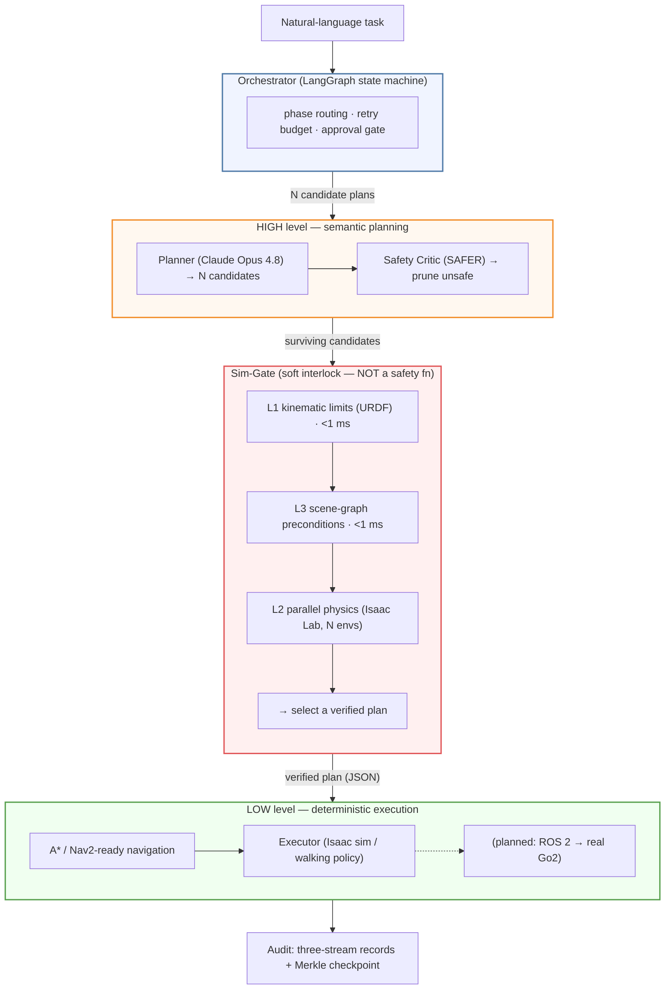
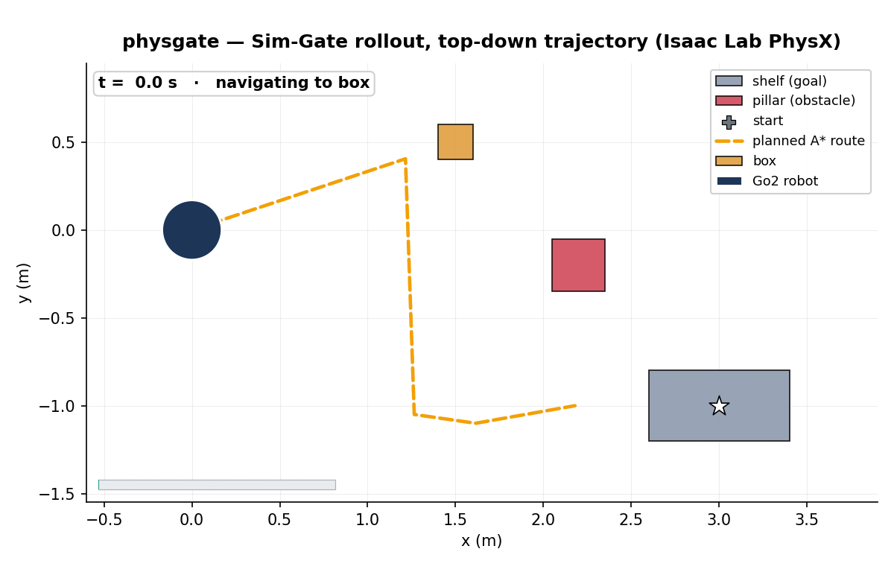
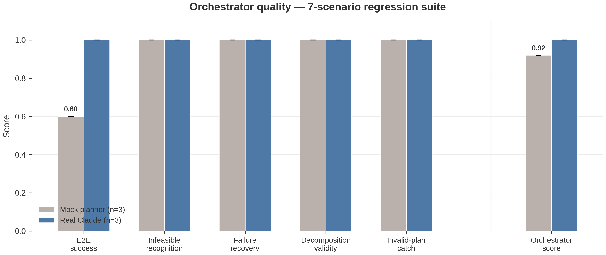

<h1 align="center">physgate</h1>

<p align="center">
  <b>Your LLM agent plans it. Physics proves the plan is right. Then the robot moves.</b><br>
  An open framework that validates LLM <i>agent orchestration</i> — task
  decomposition, preconditions, failure recovery — in GPU physics simulation,
  with deterministic navigation so feasibility never depends on the LLM
  guessing geometry.
</p>

<p align="center">
  <code>LLM decomposes → critic prunes → physics validates the plan logic → deterministic nav executes</code>
</p>

---

> [!WARNING]
> **Research software — NOT a certified safety system.** physgate is a research
> prototype. It does **not** implement or replace any safety function under
> ISO 10218-1:2025, ISO 13849-1, IEC 61508, or ISO 3691-4, and it runs on a
> general-purpose Linux + GPU stack that cannot meet PL/SIL requirements. A
> simulation PASS is **not** a safety proof. See [Safety & Scope](#safety--scope)
> before any deployment.

## What this is

LLM agents that drive robots execute hazardous instructions ~95% of the time even
when capable of refusing (SafeAgentBench). And LLM-generated plans fail in
characteristic ways: wrong step ordering, violated preconditions, no recovery
after a failed action, and confidently attempting impossible tasks.

physgate is a **dual-system architecture** with a physics-verification gate between
the LLM agent and the robot:

1. **HIGH level — the LLM agent (Claude)** decomposes a natural-language task into
   semantic skill plans (`move_to_pose(<object>)` / `pick` / `place`). It does NOT
   do geometry: no coordinates, no waypoints, no obstacle avoidance.
2. **A safety-critic agent** adversarially prunes plans that violate safety contracts.
3. **The Sim-Gate** validates surviving plans in **parallel NVIDIA Isaac Lab physics
   simulation** — step ordering, preconditions, and physical outcome (does the box
   actually end up on the shelf?).
4. **LOW level — deterministic navigation** (A\* occupancy-grid planner behind a
   Nav2-compatible interface) executes the winning plan. Obstacle avoidance is
   GUARANTEED here, never guessed by the LLM.

The core thesis: **physics simulation is the highest-quality verifier of agent
orchestration** — it catches wrong decomposition, unmet preconditions, and
infeasible requests more reliably than a neural verifier or LLM self-critique.
What physics does NOT need to do is rescue bad route geometry: with navigation in
the right layer, any well-formed plan is executable (measured feasibility ~100%,
see `benchmarks/rebuild/`).

## What this is NOT

- **Not a certified safety component.** It is an application-layer *soft interlock*,
  not a safety-rated function. See [Safety & Scope](#safety--scope).
- **Not a real-time controller.** The planner operates at seconds-per-decision; it
  never enters the motor control loop.
- **Not a claim that simulation guarantees real-world safety.** The sim-to-real gap
  is real; a sim PASS reduces risk, it does not prove safety.

## Architecture



Full design: [`docs/design/architecture.md`](docs/design/architecture.md) and the
architecture-correction record [`docs/design/REBUILD.md`](docs/design/REBUILD.md).

## Watch it run — real robotic control in Isaac Sim

**Isaac Sim camera — policy-validation rollout** (Go2 rsl_rl walking policy, PhysX):

<p align="center">
  
</p>

A trained Go2 locomotion policy (rsl_rl) walks the A\*-planned route around the
pillar (red), picks the fallen box, carries it, and places it on the shelf — captured
live from the **same code path the Sim-Gate uses for validation**
(`rollout_plans_with_policy` + recording hook, [`benchmarks/rebuild/record_rollout.py`](benchmarks/rebuild/record_rollout.py)).
The carried box rides overhead because the MVP carry is explicit bookkeeping, not
gripper physics (see `DECISIONS.md` D-018); what *is* physics: walking, obstacle
clearance, and the momentum-carrying release at placement.

**Top-down trajectory — planned A\* route vs the trail the robot actually walked:**

<p align="center">
  
</p>

The planned route (amber dashed) and the robot's actually-walked trail (teal) —
recorded from simulation state, with automated plausibility checks (trail never
enters the obstacle footprint; box ends at shelf height; speed stays in the
locomotion envelope). Raw data: [`docs/media/rollout_trajectory.json`](docs/media/rollout_trajectory.json).

> Both clips are committed under [`docs/media/`](docs/media/) (`isaac_rollout.gif`,
> `topdown_trajectory.gif`) and also available as MP4 (`isaac_rollout.mp4`).
> If a GIF does not animate in your viewer, open it directly from the repo.

## Status

🚀 **The pipeline runs end to end, and the architecture was corrected after
adversarial review** (2026-06-03). The full loop — natural-language task → N=8
candidate plans → safety critic → Sim-Gate (L1 kinematic → L3 scene-graph → L2
parallel Isaac Lab physics) → deterministic-navigation execution with a trained
Go2 walking policy — works on the target hardware.

Key correction ([`docs/design/REBUILD.md`](docs/design/REBUILD.md)): an earlier
version pushed obstacle avoidance to the LLM (straight-line low level + a
hand-placed rescue waypoint), which produced a misleading "only 17% of LLM plans
are feasible, best-of-N fixes it" headline. That was an artifact of the layering
defect. With deterministic A\* navigation in the low level, **feasibility of
well-formed plans is ~100%** (mock 6/6, real Claude 8/8 — `benchmarks/rebuild/`),
and the project's evaluation focus is **agent-orchestrator quality**
(`benchmarks/orchestration/`): decomposition, preconditions, recovery,
infeasibility recognition.

See [`STATUS.md`](STATUS.md) for the component matrix, [`DECISIONS.md`](DECISIONS.md)
for build decisions, and [`benchmarks/`](benchmarks/) for results and demo transcripts.

## Results

<!-- physgate:results:begin (auto-generated by benchmarks/render_readme.py — edit the JSONs, not this block) -->

### E1 — Pipeline ablation: what each validation layer is worth

The core experiment: the same contaminated plan pool (clean + defect-injected
plans) and the same generated task instances, run through four pipeline
configurations. Without validation, defective plans execute and fail; without
*physics/navigation-level* validation, impossible tasks are executed instead of
rejected.


| Pipeline | Success rate (feasible tasks, 95% CI) | Rejection rate (infeasible tasks) |
|---|---|---|
| A0 — No validation | 0.43 [0.38, 0.48] | 0.00 |
| A1 — + LLM critic | 0.50 [0.45, 0.55] | 0.00 |
| A2 — + Symbolic gate | 1.00 [0.84, 1.00] | 0.00 |
| A3 — + Physics gate (nav + goal) | 1.00 [0.84, 1.00] | 1.00 |

n = 20 feasible + 8 infeasible
procedurally generated layouts (A*-certified labels); plan pool of
21 plans. Methodology:
[`docs/design/EVALUATION_METHODOLOGY.md`](docs/design/EVALUATION_METHODOLOGY.md).

### E2 — The gate as a classifier (defect-injection corpus)

Every validation layer scored as a binary classifier over a labeled corpus of
clean and systematically corrupted plans (defect taxonomy from the
plan-verification literature). This substantiates the layered-defense claim:
each layer catches strictly more defect classes, with zero false positives.


| Validation layer | Precision | Recall | F1 | False-positive rate | Wall time |
|---|---|---|---|---|---|
| LLM critic | 1.00 | 0.25 | 0.40 | 0.00 | 0.0 s |
| + L1/L3 deterministic checks | 1.00 | 0.75 | 0.86 | 0.00 | 0.0 s |
| + Symbolic L2 (full gate) | 1.00 | 1.00 | 1.00 | 0.00 | 0.0 s |
| Isaac physics L2 | 1.00 | 1.00 | 1.00 | 0.00 | 76.4 s |

The physics gate matches the symbolic gate on plan-level defects (consistency
check) — its *unique* value is world-level infeasibility (E1's right panel) and
physical outcome verification, which no symbolic layer can provide.

### Feasibility — the 17% artifact is eliminated

Before the rebuild, "feasibility" measured whether the LLM happened to name a
hand-placed rescue waypoint (obstacle avoidance in the wrong layer). After the
rebuild (deterministic A* navigation), every well-formed decomposition is
physically feasible:


| Planner | Pre-rebuild (artifact) | Post-rebuild | GPU wall |
|---|---|---|---|
| Mock planner | 2/8 (25%) | **6/6 (100%)** | 13.2 s |
| Real Claude | 1/7 (14%) | **8/8 (100%)** | 14.1 s |

Repeat statistics across 3 independent runs (fresh LLM generations each time): mock 18/18 plans; Claude 24/24 plans — 100% ± 0%.

### Orchestration regression suite (v1)

7 scenarios (ordering / preconditions / recovery / multi-step / infeasible) run
through the **real LangGraph orchestrator** with fault injection. Retained as a
regression test; the headline evidence is E1/E2 above.



| Metric | Mock planner | Real Claude |
|---|---|---|
| End-to-end success (feasible tasks) | 0.60 | 1.00 |
| Infeasible-task recognition | 1.00 | 1.00 |
| Transient-failure recovery | 1.00 | 1.00 |
| Decomposition validity | 1.00 | 1.00 |
| Invalid-plan catch rate | 1.00 | 1.00 |
| **Orchestrator score** | 0.92 | 1.00 |

Error bars: mean ± sd over 3 independent runs (fresh LLM plan generations each run).

### GPU parallel-validation scaling (RTX PRO 6000 Blackwell, 300 W)


| Parallel envs | env-steps/s | Scaling efficiency |
|---|---|---|
| 1 | 281 | 1.00 |
| 4 | 1,118 | 0.99 |
| 16 | 4,360 | 0.97 |
| 64 | 16,237 | 0.90 |
| 256 | 64,249 | 0.89 |
| 1024 | 250,227 | 0.87 |

Efficiency declines monotonically; the saturation knee was **not reached** in the measured range — 1024 envs is the largest measured point, not a limit.

_This section and its charts are generated by `benchmarks/render_readme.py` from the JSONs in `benchmarks/*/results/` — regenerate after re-running any benchmark; do not edit by hand._

<!-- physgate:results:end -->

## Quick start

```bash
# Pure-logic pipeline (no GPU, no API key needed)
pip install -e ".[dev]"
pytest                                    # pure-logic test suite (~200 tests)
python examples/fetch_and_place.py        # offline end-to-end demo
python benchmarks/orchestration/run_eval.py --planner mock   # orchestrator eval

# With real LLM planning — either credential works:
ANTHROPIC_API_KEY=sk-ant-api03-... python examples/fetch_and_place.py    # API key
CLAUDE_CODE_OAUTH_TOKEN=sk-ant-oat01-... python examples/fetch_and_place.py
#   ^ Claude subscription token (from `claude setup-token`); routed through
#     Claude Code headless mode automatically — see DECISIONS.md D-015

# With Isaac Sim physics validation + execution (requires the env_isaaclab venv,
# see scripts/install_sim_stack.sh and DECISIONS.md D-005)
source ~/env_isaaclab/bin/activate
pytest tests/test_isaac_sim_gate.py       # Isaac integration tests
python examples/fetch_and_place.py --isaac
```

## Hardware & requirements

Verified known-good stack on NVIDIA RTX Pro 6000 Blackwell (sm_120), June 2026:

| Layer | Version |
|---|---|
| OS | Ubuntu 22.04.5 LTS |
| NVIDIA driver | 580.65.06 (**not** 595.x) |
| CUDA / PyTorch | 12.8 / 2.7.0+cu128 |
| Isaac Sim / Isaac Lab | 5.1.0 / 2.3.2 |
| ROS 2 | Humble |
| Planner LLM | Claude Opus 4.8 (cloud API — not local) |

> [!NOTE]
> The RTX Pro 6000 has a known sustained-compute chip-reset issue (drivers 570–595,
> unresolved by NVIDIA as of mid-2026). Phase 0 benchmark #1 stress-tests for this;
> mitigations are power-capping (`nvidia-smi -pl 400`) and keeping LLM inference on a
> cloud API rather than the local GPU.

## Safety & Scope

physgate is an **application-layer (Layer 4) soft interlock**. It sits *above* — and
does not replace — the hardware safety layers that a certified deployment requires:

```
Layer 4  physgate (LLM planner + Sim-Gate + RL fallback)   ← soft interlock, NOT certified
Layer 3  Motion control / ROS 2 / unitree_sdk2             ← not safety-rated
Layer 2  Safety PLC / FSoE (PLd/SIL2)                      ← does NOT exist on Go2
Layer 1  Hardware E-stop / SRSF                            ← does NOT exist on Go2
Layer 0  Mechanical limits / motor current cutoff (firmware)
```

- **Not a safety function** under ISO 10218-1:2025 / ISO 13849-1 / IEC 61508 / ISO 3691-4.
- **The RL fallback is not formally verified** — no barrier certificate; Black-Box
  Simplex (arXiv:2102.12981) / ASTM F3269-21 guarantees do not hold. It is a software
  watchdog with an RL fallback.
- **The Unitree Go2 is a research platform** with no certified hardware safety layer
  (FCC/CE radio compliance only).
- **EU Machinery Regulation 2023/1230** (mandatory 2027-01): AI safety components with
  self-evolving behavior require Notified Body assessment. physgate does not satisfy
  this and must not be represented as safety validation in EU deployments.

**What physgate CAN provide:** a meaningful reduction in the probability of
kinematically infeasible, contextually inappropriate, or unreviewed commands reaching
the robot, compared to unmediated LLM-to-robot execution — an engineering safeguard
for research settings, not a certified safety function.

PROVIDED "AS IS" WITHOUT WARRANTY. Do not deploy near persons without hardware safety
infrastructure independent of this software.

## License

[MIT](LICENSE) © 2026 Wei Cheng (Wayne) Chiu
