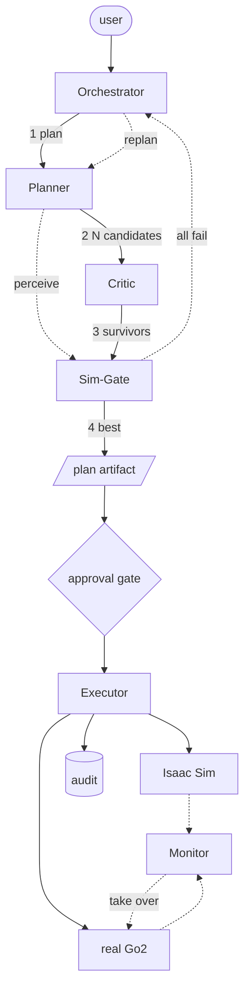
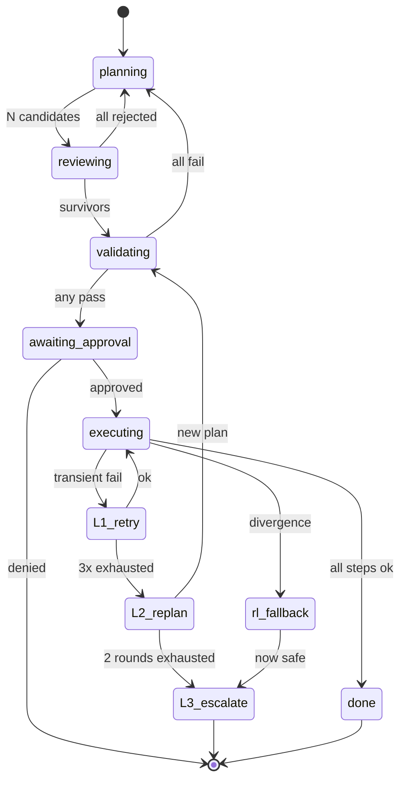
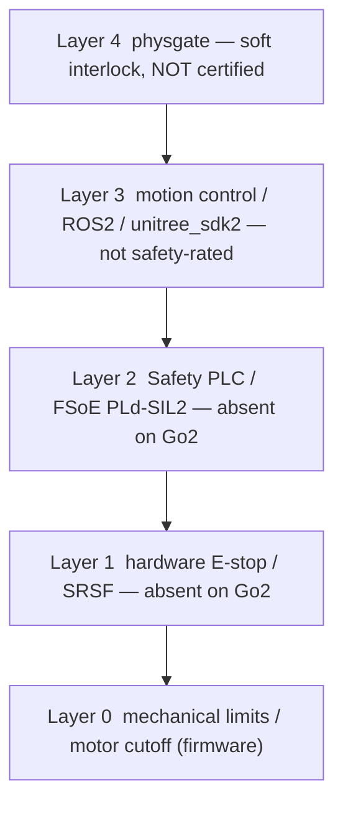
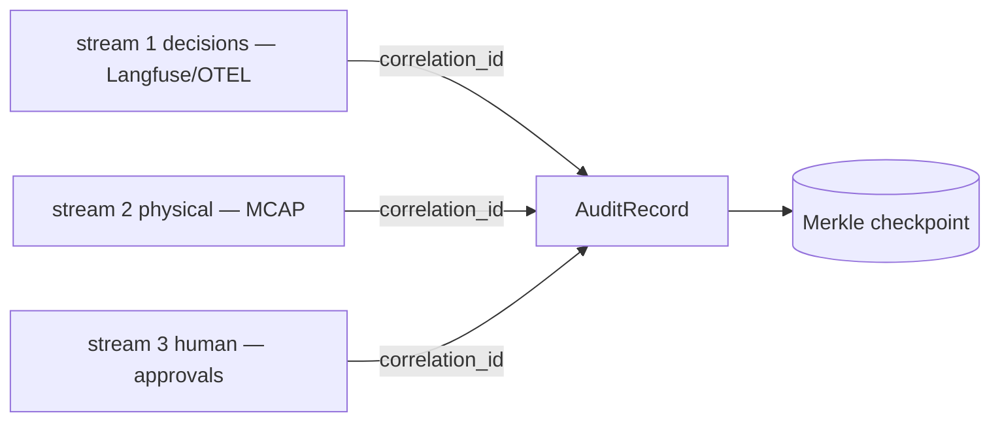

# physgate — Architecture

> [!CAUTION]
> **SUPERSEDED.** This document predates the navigation rebuild (2026-06-03).
> The authoritative design is [`REBUILD.md`](REBUILD.md). Key corrections:
> best-of-N framing eliminated, RL fallback and Monitor components do NOT exist,
> PostgresSaver → MemorySaver, ROS 2 executor is NOT implemented.
> Retained for historical context only.

> Research software. **Not a certified safety system.** See [README Safety & Scope](../../README.md#safety--scope).

physgate inserts a **physics-verification gate** between an LLM planner and a robot:
the LLM proposes *N* candidate plans, a safety critic prunes the unsafe ones, surviving
plans are validated in parallel Isaac Lab physics simulation, and only the most feasible
plan is executed. The thesis is that **physics simulation is the highest-quality verifier**
for robot plans — more accurate than a neural verifier or LLM self-critique.

## 1. System overview

| Node | LLM? | Role |
|---|---|---|
| Orchestrator | No | LangGraph + Postgres state machine; phase routing, retry budget, approval gate |
| Planner | Yes (Opus 4.8) | natural-language task → N candidate plans (the real latency bottleneck, 75–85%) |
| Critic | Yes (same model, different prompt) | adversarially prune plans vs safety contracts (SAFER pattern) |
| Sim-Gate | No (physics) | L1 → L3 → L2 + best-of-N selection. **Soft interlock, NOT a safety function.** |
| plan artifact | No (data) | **dual-envelope boundary: no code crosses to the real robot**, only structured JSON |
| approval gate | No | orchestrator interrupt (NOT MCP Elicitation — unsupported in Claude Code) |
| Monitor | No | sim/real divergence → RL fallback takes over (pure reflex, no LLM in loop) |

## 2. Failure-recovery state machine

| Transition | Owner | Calls LLM? |
|---|---|---|
| L1 retry ×3 | Orchestrator | No (saves tokens) |
| L2 replan ×2 | → Planner (with structured failure report) | Yes (only path back to LLM) |
| L3 escalate | approval gate | No |
| RL fallback take-over | Monitor (pure reflex) | No |

## 3. Safety layering (where physgate sits)

physgate contributes Layer 4 only. The Go2 lacks the certified Layers 1–2 (FCC/CE radio
compliance only). Compare Boston Dynamics Spot (hardware SRSF) and Agility Digit (Safety
PLC PLd + FSoE): their AI/application layers sit *above* a certified hardware layer.

## 4. Audit (three-stream correlation)

`AuditRecord` fields: `correlation_id` (`task_id/step_id`, the shared join key across all
three streams), model id/hash/quantization, operator id + authorization, environment
conditions (temp / battery / network), firmware version, video retention ref, LLM
reasoning chain, sim/real flag, primary timestamp + clock source. Tamper-evidence uses a
**periodic Merkle root** (certificate-transparency style), not an inline hash chain
(aviation/automotive/industrial robots do not use hash chains).

## 5. Design decisions (summary)

| Dimension | Decision |
|---|---|
| Plan representation | flat JSON step list (1 step ↔ 1 tool call); BT deferred until >20 skills |
| Validation gate | L1 kinematic → L3 scene-graph → L2 parallel physics + best-of-N; soft interlock |
| MCP tools | 3 tools (`query_scene`, `move_to_pose`, `execute_skill`); approval via orchestrator interrupt; long-ops via LangGraph/Temporal (not MCP Tasks) |
| Execution abstraction | dual-backend (Isaac Sim oracle co-resident with real robot); dual-envelope (code only sim-side) |
| Orchestration / state | LangGraph + PostgresSaver (MVP) → Temporal (production); never a hand-rolled JSON state file |
| World state | flat object-list JSON + UsdSemantics labels; real side reconstructs same schema via GroundingDINO + depth |

## 6. Best-of-N: a quality contribution, not a speed one

> **⚠️ SUPERSEDED — see [REBUILD.md](REBUILD.md).** The best-of-N / "17% feasible"
> result below is an ARTIFACT of a layering defect (obstacle avoidance was pushed to the
> LLM; the low level is a straight-line driver). With deterministic Nav2 navigation it
> vanishes. The corrected architecture (high=agent, low=Nav2, Sim-Gate=agent evaluation)
> is authoritative in REBUILD.md.

An earlier framing claimed parallel validation is "free" and that this is a test-time
compute speedup. Adversarial review corrected this: for Go2-class robots the GPU does not
saturate until ~512+ environments, and the real latency bottleneck is **LLM planning**
(75–85% of wall-clock), not physics validation (<1%). physgate's contribution is therefore
**plan quality** — physics is a more accurate verifier than neural verifiers or LLM
self-critique — and the honest deliverable is a cost/quality curve, not a "free" claim.
The value of `N` is determined empirically by the Phase 0 GPU-saturation benchmark.
